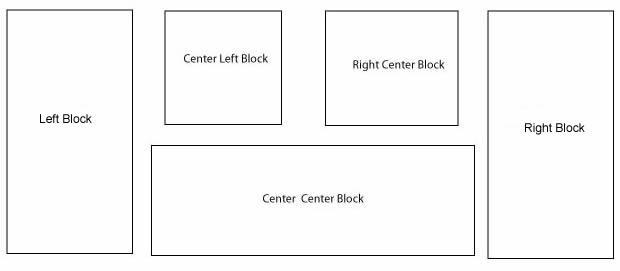
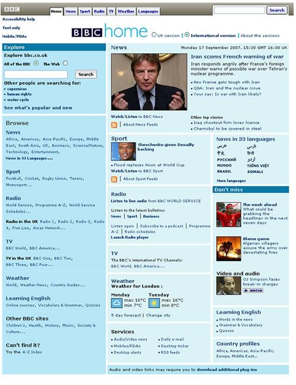
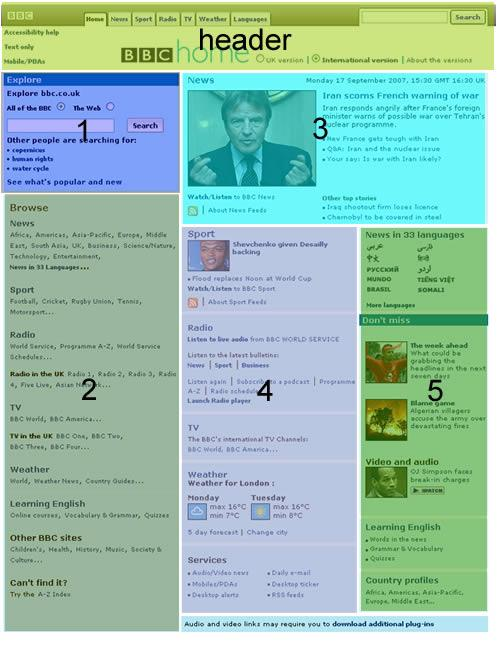
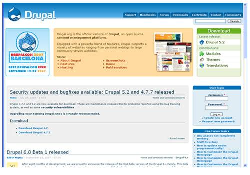
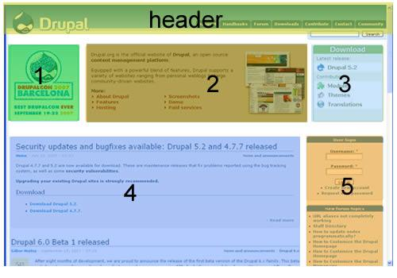
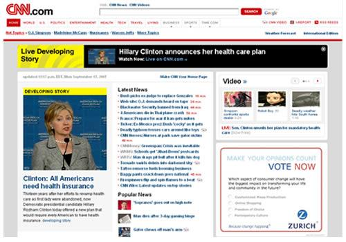
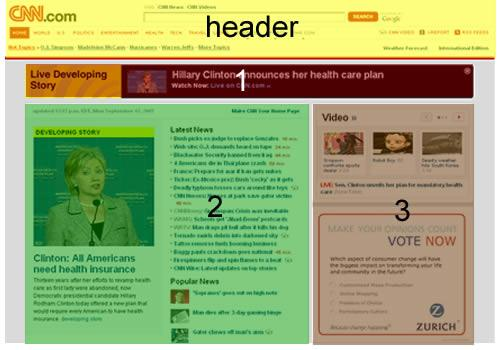

# 6.0 Theme Development

Besides developing modules, I have also developed my fair share of themes. I have never released any because they belong to my clients. So here is some pointers for themes developers.
 
**Think outside the Box.**

By analysing the default theme, we can see xoops groups blocks into 5 blocks. The standard layout can be seen below.

 
Although this is the standard, you can place the block groups anyway you like. Let's look at some practical examples www.bbc.co.uk:
 

   
I've divided the BBC page into 5 blocks:
1. 
Left Block. It holds 1 single block.
1. 
Center Left Block. Holds one block.
1. 
Right Block. Holds one block.
1. 
Center Center block. Holds several blocks.
1. 
Center Right Block. Holds several blocks.

I've rearranged the block groups to give me this flexibility. Another mistake is to think that each block group MUST contain several blocks. This is a common misconception. You can place a block group so that it only takes a single block.

Here's another example: www.drupal.org

 
   
1. 
Center Left block
1. 
Center Center block
1. 
Center Right block
1. 
Left block
1. 
Right block
 
www.cnn.com

  
   
The interesting thing in this example is that the header has a dynamic width while the main body has fixed width.

1. 
Center Center block
1. 
Center Left block
1. 
Center Right block

As you see from my examples, **think outside the box**. Don't let yourself be limited by "names" where the left block HAS to be on the left; it doesn't. As I've said in part 5 of my tutorials, don't start with code, start with a pencil and piece of paper on your new themes (that's how I do it). If you prefer start with a vector or image program.

**Don't let your creativity be limited by software!**
